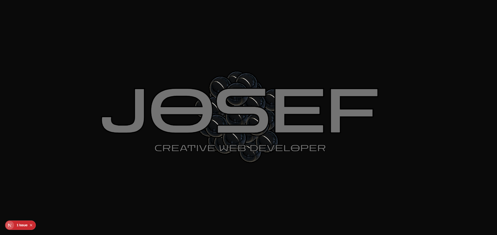

# 🚀 JOSEF PORTFÓLIO

Bem-vindo(a) ao meu portfólio!  
Aqui você encontra uma seleção dos meus principais projetos, habilidades e experiências como desenvolvedor web. Este site foi criado para apresentar meu trabalho de forma **interativa**, **moderna** e **responsiva**, combinando design, tecnologia e animações 3D.



## ✨ Funcionalidades

✅ Apresenta meus projetos e serviços.  
✅ Página inicial interativa com elementos em 3D.  
✅ Seção “Sobre” para contar um pouco da minha história.  
✅ Formulário de contato funcional com envio de e-mail.

## ⚙️ Tecnologias Utilizadas

- **Next.js:** Framework React para aplicações full-stack com renderização SSR, SSG e ISR.
- **Framer Motion:** Animações fluidas e interativas para uma navegação envolvente.
- **Tailwind CSS:** Estilização responsiva, produtiva e altamente customizável.
- **React Three Fiber:** Gráficos 3D integrados ao React, para experiências visuais únicas.
- **locomotive-scroll:** Scroll suave com parallax e animações baseadas no deslocamento da página.
- **Nodemailer:** Envio de e-mails de forma prática e segura via formulário de contato.
- **react-icons:** Ícones em SVG práticos e leves, com visual consistente.

## 🌐 Acesse Online

👉 [**Veja online**](https://josefmmxv.vercel.app/)

## 📦 Instalação Local

### Requisitos
- Node.js (v14 ou superior)
- npm ou yarn

### Passo a passo

1. Clone o repositório:
   ```bash
   git clone https://github.com/Josefs-stack/josefmmxxv.git
   cd josefmmxxv

2. Instale as dependências:
   # Usando npm
   npm install
  
   # ou usando yarn
   yarn install
  
3. Execulte o projeto:
   npm run dev

4. Acesse:
  http://localhost:3000


